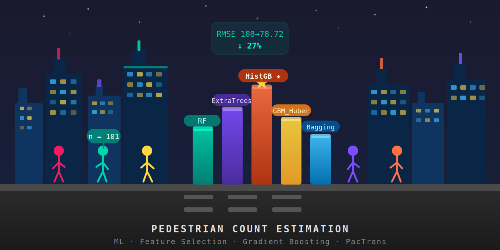

# Pedestrian Count Estimation
### Machine Learning Pipeline for Urban Pedestrian Volume Prediction


<p align="center">
  
</p>

=======

> **PacTrans Final Project Report** — Pacific Northwest Transportation Consortium (PacTrans), USDOT University Transportation Center for Federal Region 10

---

## Overview

This repository contains the complete Python pipeline developed to predict daily pedestrian volumes at urban intersections in the Pacific Northwest using built-environment and land-use features. Starting from a Negative Binomial GLM baseline implemented in R, the project systematically improved prediction accuracy through feature selection, cross-validation, and hyperparameter tuning.

**Best result:** HistGradientBoosting with Poisson loss + L1 Lasso (20 features) + Repeated 3×10 CV — **RMSE = 78.72, SMAPE = 49.93%** — a **27% improvement** over the R-code GLM baseline (RMSE = 108).

---

## Dataset

| Property | Value |
|---|---|
| Sites | 101 pedestrian count locations, Pacific Northwest |
| Target variable | Daily pedestrian volume (`pm_tot`) |
| Train / Holdout | 81 sites / 20 sites |
| Candidate features | 79 raw → 92 after one-hot encoding |
| Feature categories | Street network, land use, transit, demographics, crossing characteristics, temporal |

---

## Pipeline

The project progressed through five sequential experiment phases, each building on the previous:

```
Dataset (101 sites, 79 features)
    │
    ▼
R-code GLM Negative Binomial baseline  ─── RMSE = 108
    │
    ▼
ML model comparison (RF, HistGB_Poisson — same R-code features) ─── RMSE = 92.71
    │
    ▼
Full feature space → overfitting (GLM MAPE = 25,455%)
    │  Motivates feature selection
    ▼
Feature selection  ┌─ L1 Lasso (18 feat, coef)         ← selected ★
                   ├─ Mutual Information (20 feat, MI score)
                   └─ RF Importance (20 feat, Gini score)
    │
    ▼
Cross-validation  (5-Fold / 10-Fold / Repeated 5×10 / Repeated 3×10)
    │
    ▼
Systematic experiments
    ├─ Exp 1: CV strategy selection     (32 configs)
    ├─ Exp 2: Feature count sweep       (40 configs)
    ├─ Exp 3: Hyperparameter tuning ★   (~70,000 model fits)
    ├─ Exp 4: Log-transform of target
    └─ Exp 5: Stacking ensembles
    │
    ▼
Combined ranking model selection (RMSE + MAPE + SMAPE × 4 CV strategies)
    │
    ▼
Best model: HistGB_Poisson · L1 Lasso · 20 features · Repeated 3×10 CV
            RMSE = 78.72 · MAPE = 51.79% · SMAPE = 49.93%
```

---

## Models Evaluated

| Model | Algorithm | Key Strength |
|---|---|---|
| `HistGB_Poisson` ★ | Gradient boosting (Poisson loss) | Ideal for count data; internal log-link |
| `RandomForest` | Bagged decision trees | Robust; low variance |
| `ExtraTrees` | Extremely randomized trees | Reduces overfitting on small n |
| `HistGB_SquaredError` | Gradient boosting (MSE loss) | Isolates effect of loss function |
| `GradientBoosting_Huber` | Boosting (Huber loss) | Robust to high-count outliers |
| `PoissonRegressor` | GLM (log-link) | Interpretable linear baseline |
| `Bagging_HistGB` | Bootstrap aggregation of HistGB | Variance reduction |

---

## Results Summary

| Phase | Model | Features | Evaluation | RMSE | SMAPE |
|---|---|---|---|---|---|
| R-code baseline | GLM NegBinomial | 10 (R-code) | Holdout | 108.00 | — |
| ML comparison | HistGB_Poisson | 10 (R-code) | Holdout | 92.71 | — |
| Feature selection | RandomForest | 18 (L1 Lasso) | Holdout | 96.33 | — |
| Cross-validation | RandomForest | 20 (L1 Lasso) | 5-Fold CV | 79.84 | 52.53 |
| Exp 3 (tuned) | HistGB_Poisson | 30 (L1 Lasso) | Rep. 3×10 | 73.72 | 50.67 |
| **Best model ★** | **HistGB_Poisson** | **20 (L1 Lasso)** | **Rep. 3×10** | **78.72** | **49.93** |
| Best model (holdout) | HistGB_Poisson | 20 (L1 Lasso) | Holdout | 87.85 | 50.07 |
| Best model (stratified) | HistGB_Poisson | 20 (L1 Lasso) | Strat. Rep. 3×10 | 81.05 | 50.23 |

---

## Best Model Configuration

```python
HistGradientBoostingRegressor(
<<<<<<< HEAD
    loss              = 'poisson',
    learning_rate     = 0.01,
    max_iter          = 500,
    max_depth         = 7,
    min_samples_leaf  = 10,
=======
    loss           = 'poisson',
    learning_rate  = 0.01,
    max_iter       = 500,
    max_depth      = 7,
    min_samples_leaf = 10,
>>>>>>> 1ec669674dc6b9dc6bb4859e2d8ce63143923f44
    l2_regularization = 1.0
)

# Feature selection: L1 Lasso, 20 features
# Cross-validation:  Repeated 3×10 (3 repetitions of 10-fold)
```

**Top features by permutation importance:**

| Rank | Feature | Importance | Description |
|---|---|---|---|
| 1 | `stv_mi` | 79.69 | Street traffic volume per mile |
| 2 | `sig_int_em` | 63.69 | Signalized intersection density |
| 3 | `dist_CBD` | 62.35 | Distance to central business district |
| 4 | `Retail Area_em` | 54.27 | Retail area (employment buffer) |
| 5 | `zch_hm` | 49.06 | Zoning commercial hectares (half-mile) |
| 6 | `swlk_len` | 41.55 | Sidewalk length |

<<<<<<< HEAD
> **Note on scores:** Feature selection uses L1 Lasso *coefficients* (directional, on the log-count scale). Feature importance in the best model uses *permutation importance* from the trained HistGB_Poisson model (non-directional; measures RMSE increase when each feature is shuffled). These are different quantities and should not be compared numerically.
=======
> **Note on scores:** Feature selection uses L1 Lasso *coefficients* (directional, on the log-count scale). Feature importance in Table 7.8 uses *permutation importance* from the trained HistGB_Poisson model (non-directional; measures RMSE increase when each feature is shuffled). These are different quantities and should not be compared numerically.
>>>>>>> 1ec669674dc6b9dc6bb4859e2d8ce63143923f44

---

## Repository Structure

```
├── preprocessing.py                        # Data loading, encoding, imputation
├── compare_R.py                            # ML models vs R-code baseline (holdout)
├── compare_R_crossvalidation.py            # Same comparison with 5-fold CV
├── all_features.py                         # Full 79-feature experiment (overfitting demo)
├── all_features_CV.py                      # Full features with CV
│
├── feature-selection.py                    # L1 Lasso, MI, RF Importance (holdout)
├── feature_selection_cv.py                 # Feature selection with 5-fold CV
├── feature_selection_cv_repeated.py        # Feature selection with Repeated CV
├── predict_with_feature_selection.py       # Prediction pipeline post-selection
│
├── cv_comparison_3rows.py                  # Exp 1: CV strategy comparison
├── Hyperparameter_tuning_experiments.py    # Exp 3: RandomizedSearchCV tuning
├── final_best_model_v2.py                  # Exp 3–5: Best model + stacking
├── find_best_model.py                      # Combined ranking model selection
├── holdout_evaluation.py                   # Final holdout evaluation
├── stratified_cv_comparison.py             # Stratified Repeated 3×10 CV
│
├── importance_by_selection_method/         # Feature scores for each selection method
│   ├── selected_feature_scores__L1_Lasso.csv
│   ├── selected_feature_scores__MutualInformation.csv
│   ├── selected_feature_scores__RandomForest.csv
│   └── importances__*__*.csv              # Cross-model importance files
│
├── tuning_results/                         # Experiment result CSVs
│   ├── experiment1_cv_strategy_comparison.csv
│   ├── experiment2_feature_count_sweep.csv
│   ├── experiment3_hyperparameter_tuning.csv
│   ├── experiment4_log_transform.csv
│   ├── experiment5_stacking.csv
│   └── feature_importance_ranked.csv
│
└── final_best_model/                       # Best model outputs
    ├── best_model_summary.csv
    ├── best_model_feature_importance.csv
    ├── all_candidates_ranked.csv
    └── cross_cv_winners.csv
```

---

## Requirements

```
python >= 3.9
scikit-learn >= 1.2
pandas
numpy
scipy
matplotlib
statsmodels       # for GLM Negative Binomial comparison
```

Install all dependencies:

```bash
pip install scikit-learn pandas numpy scipy matplotlib statsmodels
```

---

## Reproducing the Results

Each script is self-contained. Run them in the order that matches the pipeline:

```bash
# 1. Baseline comparison
python compare_R.py
python compare_R_crossvalidation.py

# 2. Feature selection
python feature_selection_cv_repeated.py

# 3. Hyperparameter tuning (computationally intensive — ~40+ hrs)
python Hyperparameter_tuning_experiments.py

# 4. Best model identification and evaluation
python find_best_model.py
python holdout_evaluation.py
python stratified_cv_comparison.py
```

> **Computational note:** Experiment 3 (hyperparameter tuning) runs approximately 70,000 individual model fits across 7 model types × 5 feature counts × 4 CV strategies × 40 random parameter combinations. Running on a single CPU may take 40+ hours. Results are pre-saved in `tuning_results/`.

---

## Citation

If you use this code or dataset in your research, please cite:

```
Golchin, B. (2026). Machine Learning-Based Pedestrian Count Estimation Using
Feature Selection and Gradient Boosting for Urban Pedestrian Volume Prediction.
Final Report, Pacific Northwest Transportation Consortium (PacTrans), USDOT
University Transportation Center for Federal Region 10.

GitHub: https://github.com/baharehgl/Pedestrian-Count-Estimations
```

---

## Acknowledgements

This project was funded by the **Pacific Northwest Transportation Consortium (PacTrans)**, USDOT University Transportation Center for Federal Region 10, University of Washington. The machine learning pipeline was built using [scikit-learn](https://scikit-learn.org).
